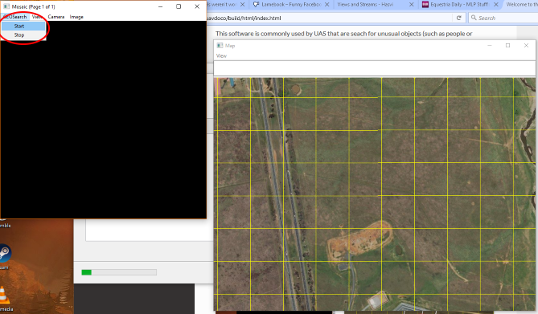
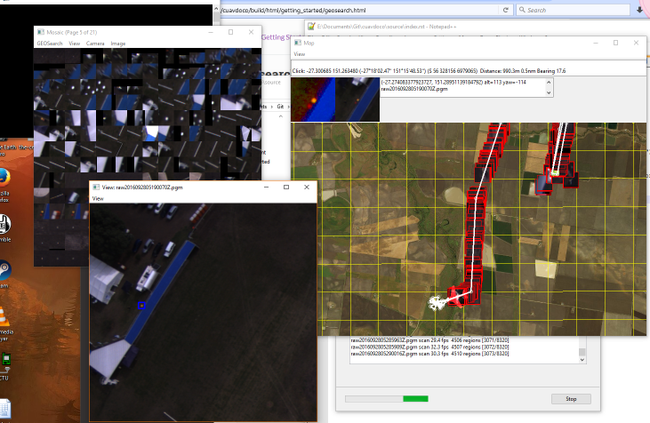

Geosearch (geosearch.py)
========================

Starting
--------

This program searches a set of photos taken by a UAV and looks for any interesting
or unusual objects (such as stranded people). Any candidate objects are georeferenced on a 
map and shown to the user.

The overall objective is to quickly and easily find the location of a missing person, based on
a set of photos taken overhead by a UAS.

The algorithm used in geosearch is very conservative and will err on the side of cuation when deciding
if an object is "interesting" enough to flag to the user. Thus it is expected that many false positives will 
be detected, at which point it will be up to the user to figure out if an image contains the desired person or 
object.

The algorithm is tuned for finding person-sized and shaped objects that contrast well against the background. So a 
person laying down and wearing high-visibility clothing will be easily found. It has been (somewhat humourously) noted
that sheep to fit in this category too. 

There are two ways of running geosearch:

#. With timestamped images and a flight log (use ``--mavlog`` to specify log)

#. With geotagged images

It has the following options and arguments:

===============================   =================================================   ===============================
Argument                          Description                                         Default
===============================   =================================================   ===============================
files                             Directory containing png image files                (none)
--mavlog                          Telemetry logfile (tlog)                            (none)
--mission                         Waypoints text file for displaying mission          (none)
--kmzlog                          Kmz file for image positions                        (none)
--triggerlog                      Robota trigger file for image positions             (none)
--time-offset                     Offset between camera and mavlink log times         0 seconds
--view                            Show images                                         False
--saveview                        Save image view                                     False
--lens                            Lens focal length                                   28
--sensorwidth                     Sensor (camera) width                               35 mm
--service                         Map tile service                                    MicrosoftSat
--camera-params                   Camera calibration json file from OpenCV            (none)
--debug                           Enable debug info                                   False
--roll-stabilised                 Is camera roll stabilised?                          False
--rotate-180                      Rotate images 180 degrees                           False
--altitude                        Altitude when images captured (0 for automatic)     0
--thumbsize                       Thumbnail size                                      60
--mosaic-thumbsize                Mosiac thumbnail size                               35
--minscore                        Minimum score for an objects to be 'detected'       100
--gammalog                        Gamma.log from flight                               (none)
--target                          Lat,lon,radius of area to search                    (none)
--categories                      Xml file containing categories for classification   (none)
--flag                            Flag positions                                      (none)
--blue-emphasis                   Enable blue emphasis in scanner                     False
===============================   =================================================   ===============================

If no arguments are supplied, a GUI will appear asking for startup options.

Otherwise, it can be started directly from the commandline. For example, In Linux:

.. code:: bash

    geosearch.py <arguments> <folder>
    geosearch.py --mavlog=flight.tlog /home/user/images/tosearch
    
    
Running
-------

After starting Geosearch, 2 windows (by default) will appear - a "Mosaic" window that shows a cropped image of
any detected interesting images and the "Map" window which shows the location of the cropped image (plus UAV, if
using a tlog).

To start the processing, go to ``GEOSearch -> Start`` in the menu of the Mosiac window (see below image, start 
button in red).

Once started, the GEOsearch will run through the images (and tlog, if used) at a faster-than-realtime rate. As
interesting objects are found in the images, a cropped image of the detected object will be display in the mosaic.

If many images are found, use the ``View -> Next Page`` menu to scroll to the next page of the mosiac (in red, below).

The objects in the mosaic will all be geolocated onto the map (in blue, below).

.. image:: geosearch1.png

Left clicking on an image in the mosiac will open an information box in the map window (in red, below). This shows
a high-contrast version of the detected object, plus it's location and image file that it appeared in.

.. image:: geosearch2.png

Right-clicking on an image in the mosaic will give a menu. Use ``Show Image`` to open a seperate window showing the
entire image with blue boxes around the detected object(s) (see below). This is useful for showing the wider area around the
detected object, giving better context.

